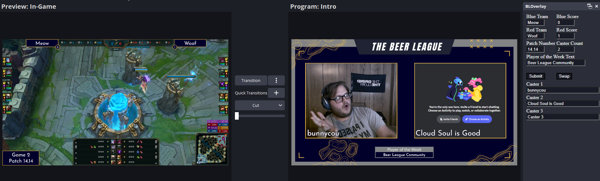

# Beer League Overlay
JavaScript + HTML + CSS Project Made for [Beer League](https://www.beerleaguelegends.org/home) Casters!

Hosted at [bloverlay.carrotbyte.net](https://bloverlay.carrotbyte.net)

## How to use

Download the [`BeerLeagueWeb.json`](BeerLeagueWeb.json) for OBS

There is a `Discord` scene that has a single window capture that needs to be set to a **discord voice chat POPOUT WINDOW** and **YOU NEED TO HAVE A DISCORD STREAM GOING**. Then the webcams/discord avatars should be in the right place. You will also need to disable your webcam input in OBS and turn your webcam on in discord. 

### OR Setup without BeerLeagueWeb.json

Add the following URLs as browser sources

`https://bloverlay.carrotbyte.net/lol/starting.html` - Starting Soon Screen\
`https://bloverlay.carrotbyte.net/lol/intro.html` - Intro Screen (POTW)\
`https://bloverlay.carrotbyte.net/lol/draft.html` - Draft Screen\
`https://bloverlay.carrotbyte.net/lol/game.html` - In Game Overlay\
`https://bloverlay.carrotbyte.net/lol/ending.html` - Stream Over Screen

## **IMPORTANT FOR ALL SETUPS** - After you get the scenes

Then add an OBS browser dock with the URL `https://bloverlay.carrotbyte.net/lol/data.html`

This will add a window in OBS that gives fields for entering the information that needs to be displayed on screen

Don't forget the [Beer League stinger transition](assets/BLStinger.webm) (transition at frame 60)

## Preview

